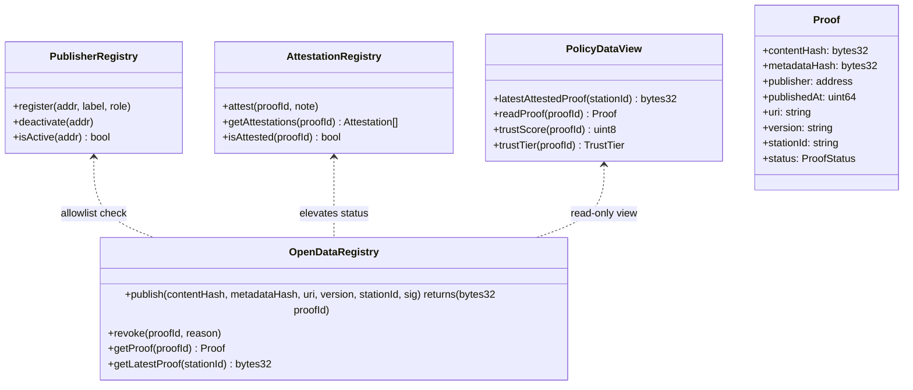
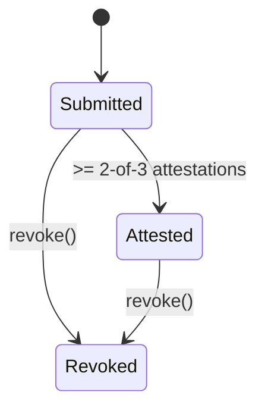
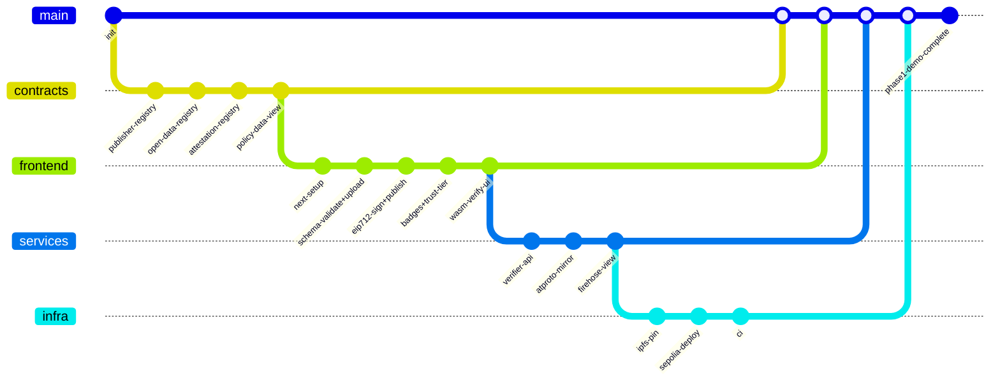

<<<<<<< HEAD
# policyloop
FtC policy loop demo
=======
# CityOS — Phase 1: Verifiable Datasets (MOENV Taipei)

> **Goal:** Build a verifiable data substrate so a policy team can later evaluate or auto-enforce **policies in general** using **auditable MOENV air-quality data** (Taipei station demo domain).

**Scope (Phase 1 only):** verifiable inputs — authorship, integrity, timeliness. _No policy condition execution yet._

---

## Why this exists
Open data portals lack cryptographic **authorship**, **integrity**, and **timeliness** proofs. Policy loops can’t trust inputs.  
Phase 1 creates on-chain proofs for MOENV hourly AQ datasets and a public attestation/revocation trail that anyone can locally verify.

---

## Architecture (at a glance)



```mermaid
sequenceDiagram
  participant Pub as Publisher (Taipei)
  participant Auto as Fetch+Publish Service
  participant UI as Web App
  participant PR as PublisherRegistry
  participant ODR as OpenDataRegistry
  participant AR as AttestationRegistry
  participant PDS as ATProto PDS
  participant FH as ATProto Firehose View
  participant V as Verifier (WASM/API)

  Auto->>Pub: Fetch MOENV Taipei dataset (+ metadata)
  Auto->>Auto: Validate schema/license; hash file &amp; metadata
  Auto->>Pub: Request EIP-712 signature (incl. publisherDid)
  Pub-->>Auto: signature
  Auto->>ODR: publish(contentHash, metadataHash, uri, version, stationId, sig)
  ODR-->>UI: DatasetPublished(proofId)

  UI->>PR: isActive(publisher)?
  PR-->>UI: true
  UI->>PDS: post(proof event)
  PDS-->>FH: stream (firehose)
  FH-->>FH: index into custom feed

  AR->>AR: collect k-of-n attestations
  AR-->>UI: isAttested(proofId) = true
  UI->>PDS: post(attestation)

  V->>ODR: read proof &amp; hashes
  V-->>V: local hash compare (WASM) / API verify
```



---

## Repo layout

```
/contracts
  PublisherRegistry.sol
  OpenDataRegistry.sol
  AttestationRegistry.sol
  PolicyDataView.sol
  interfaces/*.sol
  scripts/deploy.ts
/frontend
  pages/*
  components/*
  lib/hash.ts
  lib/eip712.ts
  lib/verify.ts
  public/schema/moenv-taipei.json
/services
  verifier-api/           # POST /verify
  atproto-mirror/         # posts chain events to PDS
  firehose-view/          # reads PDS firehose -> custom feed
/infra
  ipfs-pin.ts
  env.example
/docs
  local-hardhat.md

## Automation roadmap (Phase 1+)

In addition to the manual “Sign & Publish” demo, the production workflow introduces an automated fetcher that:

1. Polls MOENV hourly air-quality data for Taipei City.
2. Validates the payload against `public/schema/moenv-taipei.json`.
3. Reuses the hashing helpers in `frontend/lib/hash.ts` to produce `contentHash` and `metadataHash`.
4. Signs the EIP-712 `DatasetMeta` message with the ministry’s publisher key (`datasetMetaTypes` in `frontend/lib/contracts.ts`).
5. Pins the dataset to IPFS and calls `OpenDataRegistry.publish(...)` with the signature and CID.

This service is tracked under `issues/03-services.md` (task: `ingest-moev`). It runs alongside the upcoming `/verify` API and ATProto mirror, while attestations remain policy-governed (2-of-3 reviewers).
/docs
  local-hardhat.md
```

---

## Defaults / Governance

- **Publishers:** model supports multiple; Phase 1 uses one _City Publisher_ wallet.  
- **Reviewers:** City Admin, Env Dept, NGO (simulated wallets).  
- **k-of-n:** **2-of-3** required for **Attested**.  
- **Revocation:** Auditor-only; public reason stored on-chain.  
- **Trust score (0–100):**
  - +35 per public-sector reviewer (City Admin, Env Dept)  
  - +25 per NGO reviewer  
  - +15 OnTime (≤10 m), +5 SlightDelay (≤30 m), +0 Late  
  - +20 if Audited = true  
  - Capped at 100  
- **Tiers:** Submitted (< 50), Attested (≥ 50 + k-of-n met), EligibleForPolicy (≥ 70 + ≥ 1 public + ≥ 1 NGO), Audited (Auditor approved), Revoked.

---

## Data and Schema

- Dataset: **MOENV hourly air quality — Taipei City**  
- Store full file in **IPFS**; record `uri` (ipfs://CID) + `contentHash`  
- Metadata (EIP-712 `DatasetMeta`): `stationId`, `capturedAt`, `format`, `schemaUri`, `license`, optional `publisherDid`, `contentHash`

---

## Verify

- **Local (WASM):** recompute `contentHash` in-browser → compare to on-chain → verify EIP-712 signature  
- **API (/verify):** accept URL/upload → recompute → return `{ verified, reasons[] }` (for CI and DX)

---

## ATProto

- **Mirror service:** subscribes to chain events → posts signed summaries (publish/attest/revoke) to PDS  
- **Firehose view:** subscribes to PDS firehose → filters CityOS namespace → produces **custom feed** for datasets/policy events  
- **Env vars:**  
  `ATPROTO_PDS_URL`, `ATPROTO_HANDLE`, `ATPROTO_DID`, `ATPROTO_SIGNING_KEY`, `CITYOS_NAMESPACE=cityos.dataset.v1`

---

## Detailed Contracts / TS Snippets

### Solidity Interface
```solidity
interface IOpenDataRegistry {
  function publish(
    bytes32 contentHash,
    bytes32 metadataHash,
    string calldata uri,
    string calldata version,
    string calldata stationId,
    bytes calldata sig
  ) external returns (bytes32 proofId);

  function revoke(bytes32 proofId, string calldata reason) external;

  function getProof(bytes32 proofId) external view returns (
    bytes32, bytes32, address, uint64, string memory,
    string memory, string memory, uint8
  );

  function getLatestProof(string calldata stationId)
    external view returns (bytes32);
}
```

**Events**
```solidity
event DatasetPublished(bytes32 indexed proofId, address indexed publisher, string stationId, uint64 ts);
event Attested(bytes32 indexed proofId, address indexed reviewer, string note);
event Revoked(bytes32 indexed proofId, address indexed auditor, string reason, uint64 ts);
```

### EIP-712 Typed Data
```ts
export const domain = (chainId:number, verifyingContract:string)=>({
  name: "CityOS-OpenData",
  version: "1",
  chainId,
  verifyingContract,
});

export const types = {
  DatasetMeta: [
    { name: "stationId", type: "string" },
    { name: "capturedAt", type: "uint64" },
    { name: "format", type: "string" },
    { name: "schemaUri", type: "string" },
    { name: "license", type: "string" },
    { name: "publisherDid", type: "string" },
    { name: "contentHash", type: "bytes32" },
  ],
};
```

### Hashing Helper
```ts
export async function computeHashes(file: File, metadata: object) {
  const contentHash = await keccakFileChunked(file);
  const metadataHash = keccak256(JSON.stringify(minify(metadata)));
  return { contentHash, metadataHash };
}
```

---

## Acceptance Criteria

- Publish MOENV Taipei dataset → on-chain **proof (Submitted)**  
- **2-of-3 attestations → Attested**  
- **Revocation (Auditor-only)** records public reason  
- **Local WASM verify + /verify API** return true  
- **ATProto mirror + Firehose** feed functional  
- `PolicyDataView.latestAttestedProof("taipei-city")` returns proofId  
- UI displays trust score and tier  

---

## Issues (01–05)

1. **01-contracts.md** — Implement registries, events, k-of-n, revoke  
2. **02-frontend.md** — Upload → EIP-712 sign → Badges + Trust tier → WASM verify → ATProto feed widget  
3. **03-services.md** — `/verify` API, `atproto-mirror`, `firehose-view`, env vars  
4. **04-infra.md** — IPFS pin, Sepolia deploy, CI, .env templates  
5. **05-governance.md** — Allowlists, 2-of-3, Revocation SOP, Trust tiers, timeliness thresholds  

---

## Mermaid gitgraph


---

## Looping/Error Fallback Plan
If hashing or signatures fail under load:  
- Switch to streaming worker hashing and deterministic metadata serialization  
- Add golden test vectors for hashes and EIP-712 domain  
- Verify chainId + contract address in domain separator  

---

### Decision Log (Phase 1 Defaults)
- **Publishers:** multiple supported; Phase-1 uses **one City Publisher**  
- **Attestations:** **2-of-3** (City Admin, Env Dept, NGO)  
- **Role weights:** **none**; trust tiers composition-based and transparent  
- **Timeliness labels:** OnTime ≤10 m, SlightDelay ≤30 m, Late >30 m (configurable)  
- **ATProto:** **enabled now** (mirror posts + firehose feed)
