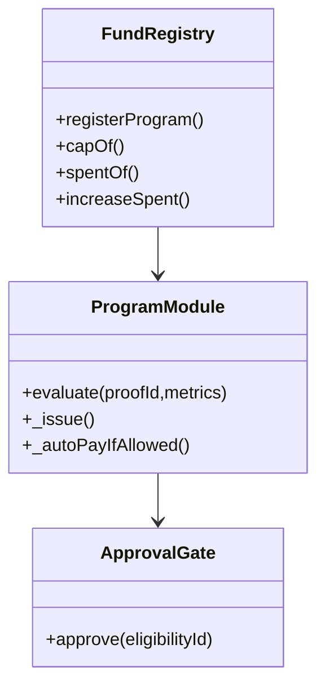
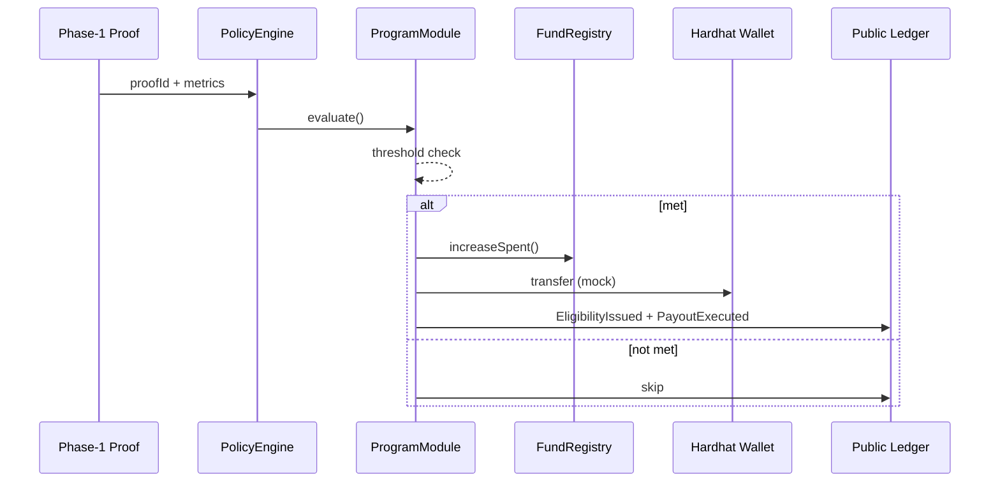
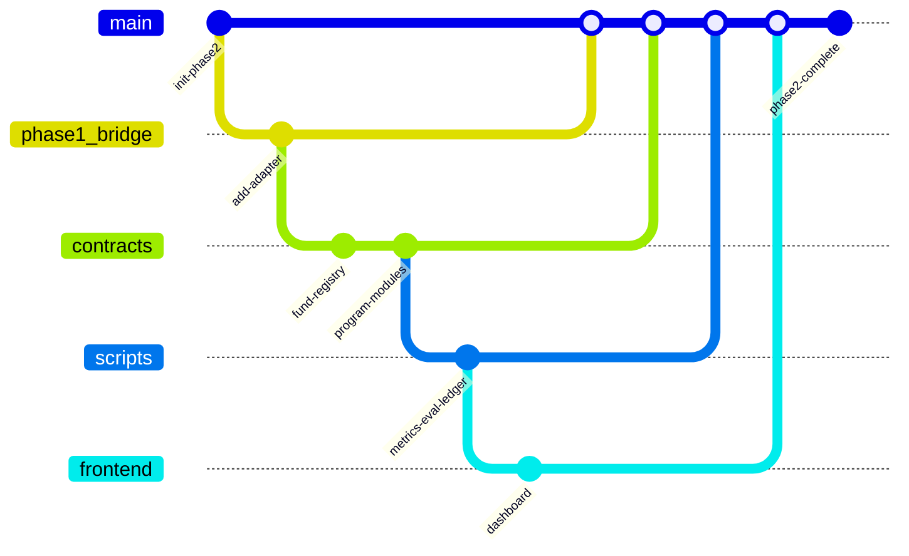

# Technical Spec — CityOS Phase 2: Taipei Air Pollution Control Fund (Transparent Automation)

## 1 · Background

**Problem Statement**  
Taipei’s Air Pollution Control Fund (APCF) manages four recurring programs — IoT sensor maintenance, high-pollution vehicle control, fixed-source inspection, and construction dust control. Today, budget releases are manual and opaque; citizens cannot verify why, when, or under what evidence funds are spent.  
**Goal:** Demonstrate a verifiable, data-driven funding mechanism in which AQI data proofs from Phase 1 determine eligibility and trigger mock payouts automatically.

**Context / History**
- Phase 1 (policyloop repo) built a verifiable-data substrate (OpenDataRegistry, AttestationRegistry, PolicyDataView) for MOENV AQI datasets.
- Phase 2 extends that substrate into conditional finance logic.
- Legal basis: Taiwan Air Pollution Control Act (Art 40) and Taipei DEP 2025 Fund Plan.

| Stakeholder | Responsibility |
|-------------|----------------|
| Taipei DEP (APCF Manager) | Defines programs + approval rules |
| CityOS Team | Build verifiable automation prototype |
| MOENV | Provide verified AQI data |
| Civic Tech Partners | Maintain public dashboard / ledger |
| Citizens & Auditors | Verify data→decision chain |

## 2 · Motivation

| Goal | Description | Metric |
|------|-------------|--------|
| Protocolize fund governance | Link verified data to budget eligibility | ≥ 4 EligibilityIssued events |
| Replace discretion with logic | Machine-evaluated triggers | 100% data-driven eligibility |
| Safe partial automation | Auto-pay ≤ 300k NTD per rule | ≥ 2 PayoutExecuted (auto) |
| Prove decision integrity | Public audit trail of fund events | `ledger.json` complete |
| Portability | External parameters only | Config-swap deploy works |
| Speed | 1-day prototype | Hardhat demo runs end-to-end < 10 min |

## 3 · Scope and Approaches

**In Scope**
- Read Phase-1 proofs (via adapter).
- Evaluate AQI / PM₂.₅ metrics against thresholds.
- Emit Eligibility + Payout events.
- Mock wallet disbursements for each program.
- Static JSON ledger + HTML dashboard.

**Out of Scope**

| Functionality | Reason Off Scope | Trade-off |
|---------------|------------------|-----------|
| Real treasury integration | Legal constraint | Mock payouts only |
| Multi-city profiles | Time limit | Taipei only |
| Live API polling | Offline build | Static proof file |
| ATProto feed | Infra heavy | JSON ledger demo |

**Value Proposition**

| Functionality | Value | Trade-off |
|---------------|-------|-----------|
| FundRegistry + ProgramModules | Verifiable budget caps | More contracts |
| Deterministic eligibility | Objectivity + auditability | Requires parameter calibration |
| Approval gate | Keeps legitimacy | Adds human step > 300k |
| Dashboard | Public trust | Front-end overhead |

## 4 · Step-by-Step Flow

**Main Path**

1. Phase-1 proof exists (`proofId`).
2. Weekly aggregator (shown in the UI) bundles Taipei datasets and computes metrics.
3. PolicyEngine reads proof + weekly metrics via adapter.
4. If threshold met → `EligibilityIssued`.
5. If amount ≤ `autoPayBelow` → mock transfer + `PayoutExecuted`.
6. Events recorded → `ledger.json` → dashboard.

**Error / Alternate Paths**

| # | Condition | System Action | Handling |
|---|-----------|---------------|----------|
| A1 | Invalid proofId | Revert | Use valid Phase-1 proof |
| A2 | Budget cap exceeded | Revert | Adjust cap / program |
| A3 | Threshold parse error | Skip + log | Manual check |
| A4 | Approval timeout | Emit alert | Manual override |

## 5 · UML / Mermaid Diagrams

**Class Diagram**

**Sequence Diagram**

## 6 · Edge Cases and Concessions

| Category | Description | Mitigation |
|----------|-------------|------------|
| Data delay | MOENV API lag > 15 min | Accept window ± 15 min |
| Budget overflow | Cap breach by auto-payout | Hard revert + flag |
| Network failure | Hardhat reset mid-script | Resume via `ledger.json` |
| Human error | Wrong approval key | ApprovalGate role check |
| Legal scope | DEP authority unclear | Simulate only (educational demo) |

## 7 · Open Questions

| Area | Question | Owner | Phase |
|------|----------|-------|-------|
| Legal | When can eligibility be binding under city law? | Ms. Lin | 2.5 |
| Finance | Should `autoPayBelow` vary by program? | Mr. Wu | 3 |
| Tech | Merge modules into one engine later? | Ms. Chen | 3 |
| Policy | Can citizens co-sign approvals? | Mr. Tsai | 2.5 |
| Civic UX | How to visualize cross-program flows? | Ms. Hsu | 3 |

## 8 · Glossary / References

| Term | Definition |
|------|------------|
| APCF | Taipei Air Pollution Control Fund |
| proofId | Hash linking Phase 1 dataset to Phase 2 action |
| EligibilityRecord | On-chain proof of threshold met |
| autoPayBelow | Max amount for instant payout (300k NTD) |
| Phase 1 | Data verifiability layer (OpenDataRegistry etc.) |
| Phase 2 | Decision integrity / conditional finance layer |
| PolicyEvent | Unified event type emitted for audit feeds |

**References**
- Taipei DEP 2025 Air Pollution Control Fund Plan
- Air Pollution Control Act (Art 40)
- MOENV API AQX_P_432
- CityOS Phase 1 (policyloop repo)

## 9 · AI Looping (Execution Guidelines for Codex)

**Objective:** Ensure autonomous implementation completes without silent failure.

| Trigger | AI Action |
|---------|-----------|
| Compile error | Retry once after flattening imports → if fail again, flag human |
| Missing events | Re-run `scripts/programs/metrics/evaluate-all.ts` then `export-ledger.ts` |
| `ledger.json` empty | Check logs for `EligibilityIssued` filter and retry |
| Event count < 6 | Append diagnostic report → pause |
| Proof mismatch | Verify proofId exists in Phase-1 registry |
| Test reverts | Run Hardhat `console.log` trace to surface reason |
| Build success | Generate `ledger.log` (JSON summary of addresses + event counts) |

AI Looping cycle: **plan → build → run → verify → adjust → re-run** (stop after 2 failed verify iterations)

Every loop must validate:
- Contract compilation ✅
- ≥ 4 `EligibilityIssued` + ≥ 2 `PayoutExecuted` ✅
- `ledger.json` generated ✅
- Hardhat exit code 0 ✅

## 10 · Abstract Spec + GitGraph

Project: CityOS Phase 2 — Taipei AQI Fund Transparent Automation  
Problem: No traceable link between environmental data and funding decisions.  
Solution: Smart contracts consume Phase 1 proofs → evaluate thresholds → issue eligibility → mock disbursements → public ledger.  
Outcome: A full data → decision → action loop showing how verifiable data can govern public finance.

## ✅ Deliverable Summary

| Component | Function | Output |
|-----------|----------|--------|
| `FundRegistry.sol` | Track caps + spending | Budget proofs |
| ProgramModules | Evaluate metrics + auto-pay | Eligibility / Payout events |
| PolicyDataViewAdapter | Read Phase-1 proofs | Data integrity input |
| Scripts | Deploy + Evaluate + Ledger export | `ledger.json` |
| Frontend | Static audit dashboard | Visual transparency |

## ✅ Success Criteria

- Phase-2 build runs end-to-end with Phase-1 proofs.
- At least 4 eligibility + 2 payout events appear.
- `ledger.json` and dashboard render publicly.
- Demonstrates verifiable decision integrity loop within 1 day.
